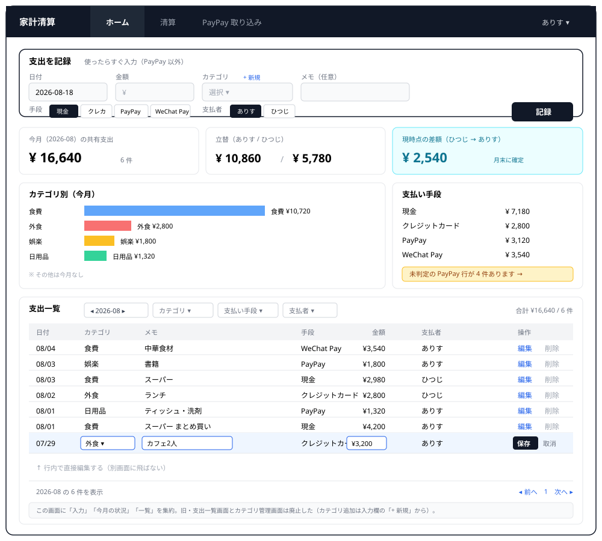
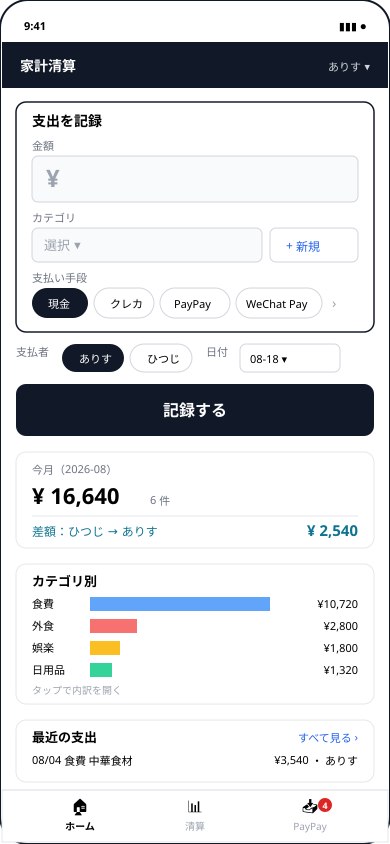
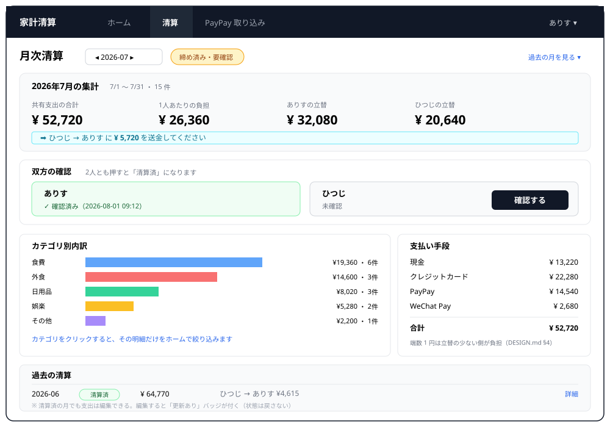
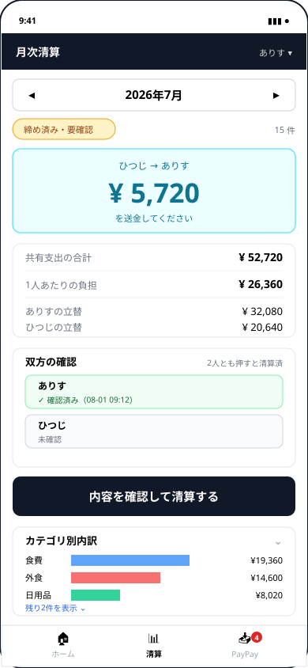
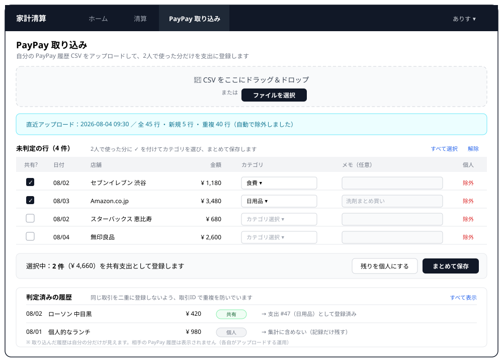
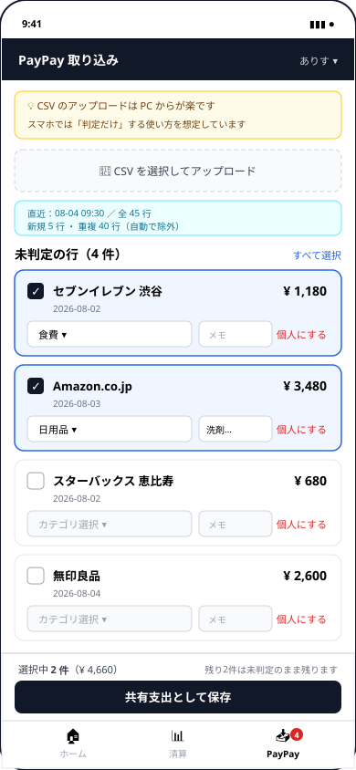
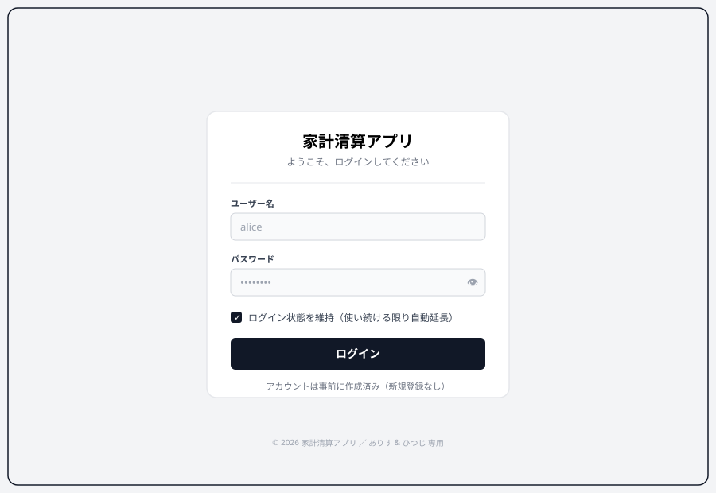

# アプリ設計方針書：パートナー共用 家計清算アプリ

作成: 2026-07-14　最終更新: 2026-07-28（§7 を追記）
Phase: 1（設計）／§7 は Phase 3 完了時点の実装ステータス

参照:
- 制作マニュアル: `/Users/sibei.he/Downloads/CURRICULUM.md`
- 座学資料: `/Users/sibei.he/Downloads/勉強会メモ.pdf`

---

## 0. 設計の大前提（座学資料より）

すべての判断は下記の原則に**整合しているか**で評価する。特定の流派名（MVC / クリーンアーキ / Atomic 等）を採用するかどうかより、性質を満たすことを優先する。

### 0.1 4つの原則
- **SOLID（単一責任）**: モジュール／フォルダは1つの責任だけを持つ
- **KISS**: シンプルに保つ。凝った抽象は必要になるまで入れない
- **YAGNI**: 今のスコープに要らないコードは書かない
- **DRY**: 同じ処理をコピーで増やさない（KISS/YAGNI と衝突したら共通化を諦める）

### 0.2 バックエンド：一方通行の依存グラフ
- 依存の向きは常に **DB操作 → データ加工 → API提供** の左→右
- 双方向依存 / 循環参照は禁止
- 階層数は規模で決める（必ずしも3層ではない）

### 0.3 フロントエンド：3階層＋依存は左→右
- **層①：汎用UI部品** — バックエンド非依存
- **層②：ビジネス概念のコンポーネント** — API接続を担う
- **層③：ページ専用の機能** — 共通化しない

### 0.4 ローカル/クラウドの対応関係（今回はローカルまで）
- ローカル: Podman × 3（DB / バック / フロント）
- クラウド（将来）: CloudSQL / Cloud Run×2、ログ→ BigQuery（dbt）
- 「後でクラウドに移せる形」= コンテナ境界と一致するモジュール境界を維持

---

## 1. アプリ概要

### 1.1 目的
家計簿（全支出をカテゴリ分けして記録・見える化）と月次清算（どちらがいくら払うかの自動計算）を**両立**させる。

### 1.2 利用者
2人固定：**ありす**（自分）／**ひつじ**（パートナー）。多人数化・サービス化は考慮しない。
※ 名前は表示用のニックネーム。DB 上は `users.id` で識別し、`users.id ASC` の順で「user A（ありす）／user B（ひつじ）」を決定する。

### 1.3 重視する機能
- カテゴリ集計・グラフ
- 月次清算の自動化
- PayPay 履歴からの共有支出の一括取り込み

### 1.4 運用フロー

**基本ルール：PayPay 以外は「支払い発生 → 即入力」**。後回し禁止。

```
【日次運用】現金 / クレジットカード / WeChat Pay
────────────────────────────────────────────────
   支払い発生（本人）
        │
        ▼
   アプリを開く → 起動画面（ダッシュボード）の最上部が
   即入力フォームになっているのでその場で入力
   （日付・金額・カテゴリ・支払い手段・支払者）
        │
        ▼
   Expense テーブルに保存
        │
        ▼
   月次集計に即時反映


【低頻度運用】PayPay（週1〜月1、各自が自分の履歴を処理）
────────────────────────────────────────────────
   PayPay アプリで自分の履歴 CSV をダウンロード
        │
        ▼
   本人がアプリに CSV アップロード
        │
        ▼
   PayPayImportStaging に取り込み（重複は自動除外）
        │
        ▼
   一覧画面で各行に「共有 / 個人」判定
        │
        ▼
   共有分だけ Expense に昇格
        │
        ▼
   月次集計に反映


【月末】自動締め → 双方確認 → 清算完了
────────────────────────────────────────────────
   月末日 23:59 に自動処理走る
        │
        ▼
   その月を「締め済み」に
        │
        ▼
   両ユーザーが UI で内容確認 → 「確認」ボタン
        │
        ▼
   両者が押した時点で「清算済」
        │
        ▼
   （済月の支出を後から編集した場合）
   月次画面に「更新あり」バッジ表示（状態は清算済のまま）
```

### 1.5 現行運用の課題（このアプリを作る動機）

現在スプレッドシートで管理しており、以下が不便：
- カテゴリ分けができていない
- 同日複数出費で SUM 関数などの手作業が必要
- PayPay の共有分抽出が全部手動
- 結果、直近3ヶ月ほど清算できていない

**成功指標**：「月末の清算が翌月頭までに終わっていること」。手間を下げて運用を破綻させないことが最上位要件。

### 1.6 スコープ外
- 個人支出の管理（PayPayステージングで「個人」判定した行は保持するのみ）
- 折半以外の負担割合、支出ごとの割合上書き
- 3人以上のグループ機能、権限管理
- 多通貨対応
- 清算済月の巻き戻し
- クラウドへのデプロイ（Phase 7）
- レシート画像の添付・OCR
- クレカ／WeChat Pay の履歴CSV取り込み（v2 で検討）
- PayPay 以外の決済 API 直接連携
- **AI 連携（LLM によるカテゴリ自動推定など）** — §1.8 参照

### 1.7 UI モック（ワイヤーフレーム）— 3画面構成（2026-08-18 改訂）

Phase 4 で作る画面の骨格。**レイアウトと要素配置を伝える目的**のワイヤーフレームで、最終ビジュアルではない（shadcn/ui + Tailwind で仕上げる予定）。

| # | 画面 | 使用頻度 | 役割 |
| :---- | :---- | :---- | :---- |
| ① | **ホーム** | 毎日 | 支出の入力・今月の状況・支出一覧をすべてここに集約 |
| ② | **月次清算** | 月1 | その月の集計・送金額・双方の確認 |
| ③ | **PayPay 取り込み** | 週1〜月1 | CSV から共有分を選んで支出に昇格 |

ナビゲーションは PC ではトップタブ3つ、スマホではボトムタブ3つ。
運用端末は **PC がメイン、入力はスマホからも行う** ため、各画面に PC 版とスマホ版を用意する。

#### なぜ7画面から3画面に絞ったか（2026-08-18 決定）

当初は7画面で設計していたが、Phase 4 の実装に入る前に見直した。

| # | 当初の画面 | 使用頻度 | 判断 |
| :---- | :---- | :---- | :---- |
| ① | ダッシュボード | 毎日 | **残す**（ホームに改称） |
| ② | 支出一覧 | 週1〜月1 | **①に統合**。ダッシュボードに既に「最近の支出」があり、別画面にする理由がない |
| ③ | 月次清算 | 月1 | **残す**。核心機能 |
| ④ | PayPay 取り込み | 週1〜月1 | **残す**。核心機能 |
| ⑤ | カテゴリ管理 | **年に数回** | **廃止**。カテゴリは5つで滅多に増えない。追加は入力欄の「+ 新規」で足りる |
| ⑥ | ログイン | Phase 5 | **Phase 5 に送る**（認証が前提のため） |
| ⑦ | アカウントメニュー | **ほぼ使わない** | **廃止**。2人固定なので表示名を変える機会がない。設定はドロップダウンに収める |

**理由**

1. **YAGNI**（§0.1）— カテゴリ管理とアカウント設定は「年に数回しか使わない画面」であり、独立した画面を作る価値が使用頻度に見合わない
2. **実装量が減る** — Phase 4 の作業が概ね半分になり、Phase 5（認証）に早く進める
3. **運用端末との一致** — PC がメインだが入力はスマホからも行う。スマホのボトムタブは3個がちょうど収まる数で、7項目のサイドナビはそもそも成立しない

**廃止した機能の行き先**

| 廃止した画面の機能 | 行き先 |
| :---- | :---- |
| 支出一覧のフィルタ・編集・削除 | ホーム画面の下部に統合。編集は**行内で直接**行う |
| カテゴリの追加 | 支出入力欄の「+ 新規」ボタン |
| カテゴリの並び替え・アーカイブ | **作らない**。必要になったら追加する |
| 表示名変更・パスワード変更・テーマ切替 | Phase 5 でヘッダーのドロップダウンに収める |

なお `categories` の API（4オペレーション）と `is_archived` カラムは Phase 3 で実装済みであり、**削除しない**。UI を作らないだけで、必要になればすぐ画面を足せる状態を保つ。

---

#### ① ホーム（＝アプリ起動画面／即入力の入口）

最上部が**支出の入力フォーム**。その下に今月の集計・カテゴリ別グラフ・支払い手段内訳・**支出一覧**（フィルタつき）。
アプリを開いた瞬間に入力を始められるレイアウトで、「PayPay 以外は即入力」ルール（§1.4）を行動で誘導する。

旧②の支出一覧画面をこの下部に統合し、編集は**行内で直接**行う（別画面に飛ばさない）。
カテゴリの追加は入力欄の「+ 新規」から行うため、独立したカテゴリ管理画面は持たない。

**PC 版**



**スマホ版** — 金額の入力欄を最大化し、「記録する」ボタンを親指の届く位置に置く。支出一覧は「最近の支出」に畳んで「すべて見る」で展開する。



---

#### ② 月次清算

その月の集計・送金額の提示・双方の「確認」ボタン・カテゴリ別内訳・過去の清算履歴。

**PC 版**



**スマホ版** — **送金額を最上部に最大サイズで置く**（この画面で一番知りたい情報のため）。確認ボタンは親指の届く位置に固定。



---

#### ③ PayPay 取り込み

CSV アップロード → 未判定行に「共有／個人」判定＆カテゴリ付与 → まとめて保存。

**PC 版** — テーブル形式で一覧性を優先。



**スマホ版** — 1行を1カードに展開。**CSV のアップロード自体は PC 推奨**である旨を画面上に明示し、スマホでは「判定だけ」する使い方を想定する。



---

#### Phase 5 で追加する画面

**ログイン** — 事前登録済みアカウントでの username + password 認証。JWT を HttpOnly Cookie に保存し、**スライディング期限方式**でアプリを使い続ける限り自動延長される（30日連続で使わなかった場合のみ再ログイン）。新規登録なし。



アカウント設定（表示名変更・パスワード変更・テーマ切替）は独立画面を持たず、
ヘッダーのユーザー名から開くドロップダウンに収める。

---

**画面から §2 ドメインへの対応**：
- ホーム = `Expense` の CRUD ＋ `MonthlySettlement` の当月サマリ ＋ `Category` の追加
- 月次清算 = `MonthlySettlement` の集計と状態遷移
- PayPay 取り込み = `PayPayImportStaging` → `Expense` への昇格フロー
- ログイン（Phase 5） = `User` の認証

### 1.8 AI 連携の再検討（2026-09-15 更新）

2026-08-18 時点では月40件程度を想定し、PayPay 明細のカテゴリ自動推定は不要と判断した。その後、実データでは月約60件となり、1件ずつ「共有／個人」を確定する操作が負担になることが分かったため、方針を見直す。

**段階的に導入する。**

1. 現在：複数行を選び、個人扱いまたは指定した1カテゴリの共有支出として一括登録する
2. v2：MCP サーバーから未判定行とカテゴリ候補を AI に渡し、分類案を受け取る
3. AI の提案を画面へ反映し、利用者が確認・修正してから既存の一括 API で確定する

AI に確定権限は持たせず、**提案と確定を分離**する。分類ミスによる清算額の変更を防ぐため、最終登録は必ず画面上の明示操作で行う。MCP 実装では送信する明細項目、利用するモデル、ログ保存範囲を設定可能にし、店舗名などの行動履歴を外部へ送る場合は利用者が明示的に有効化する。

一括共有 API は行ごとの `staging_id`・`category_id`・任意メモを受けるため、手入力と将来の AI 提案のどちらも同じ検証・トランザクション境界を通る。

---

## 2. ドメイン

### 2.1 主要エンティティ

| 概念 | 説明 |
| :---- | :---- |
| ユーザー（User） | 利用者。2人固定。 |
| 支出（Expense） | 誰がいつ何にいくら払ったか＋支払い手段。全支出＝共有支出。 |
| カテゴリ（Category） | 食費／日用品／娯楽 等の分類。ユーザーが編集可能。 |
| 月次清算（MonthlySettlement） | ある年月についての集計と確認状態。状態機械を持つ。 |
| PayPay インポート行（PayPayImportStaging） | CSV 取り込みの一時領域。共有判定後に Expense へ昇格。 |
| イベント（Event） | 追記専用のログ。§4.3 参照。 |

### 2.2 ルール
- 全支出＝共有支出のみ扱う（個人支出はアプリ管理外）
- 負担割合は**常に折半（50:50固定）**
- 清算サイクルは**月次（暦月）**
- 月末に自動で締め処理 → 両者が確認で「清算済」
- 済月の支出も編集可能。編集は支出レコードを直接書き換え、月合計は再計算。「調整」概念は導入しない
- 済月の状態は巻き戻さない。編集した場合は UI で「更新あり」バッジを出すのみ

### 2.3 状態遷移

**支出（Expense）**
```
[新規作成] → [記録済] ⇄ [編集] → [論理削除]
                │
                └── その月の集計に常に反映（済月であっても同じ）
```

**月次清算（MonthlySettlement）**
```
[未生成] → [進行中] → [締め済み] → [片方確認済] → [清算済]
              月末自動処理      片方が「確認」   両者が「確認」
                                                    │
                                                    │ 済月の支出を編集
                                                    ▼
                                            [清算済 (更新あり)]
                                            状態は清算済のまま、
                                            UI に「更新あり」バッジ
```

**PayPay インポート行（PayPayImportStaging）**
```
[CSVアップロード] → [取込済(pending)] → ┬─ [共有として採用(adopted)] → Expense を作成しリンク
                                          │
                                          └─ [個人として除外(excluded)] → 保持のみ、集計対象外
```

---

## 3. 採用アーキテクチャ

### 3.1 バックエンド：レイヤードアーキテクチャ 3層
- 層構成：`api/`（FastAPI ルーター + Pydantic）→ `services/`（業務ロジック）→ `db/`（SQLAlchemy）
- 依存の向き：`api → services → db` の一方向のみ
- モジュール分割：`expenses` / `settlement` / `categories` / `paypay_import` / `events` を各層に横断
- **理由**：座学資料の「一方通行」を最も素直に体現。KISS と拡張性の中間。

### 3.2 フロントエンド：Feature-based（3階層）
- `components/ui/` — 汎用UI（shadcn/ui、バック非依存）
- `features/xxx/` — ビジネス概念のコンポーネントとフック（API 呼び出しをここに閉じる）
- `app/` — ページ本体。features を組み合わせる
- 依存の向き：`app → features → components/ui` の一方向
- **理由**：座学資料の3階層と1対1で対応。エンティティ単位でコロケーションできる。

### 3.3 ドメイン設計：テーブル駆動
- SQLAlchemy モデル＝ドメインモデルとする
- ビジネスルール（状態遷移・折半計算）は `services/` の関数として書く
- **理由**：ルールが単純で、まず全体を通すことを優先。Phase 5 でテストに支障が出たら「純関数への切り出し」に段階的リファクタする。

---

## 4. データモデル

金額はすべて**円（int）**。小数は持たない。

**折半の端数ルール**（2026-08-04 決定）：月の合計が奇数のとき、1人あたりの負担額は切り捨て（`合計 // 2`）で計算し、**月内で立替額が少なかった側が余りの1円を負担する**。`services/settlement.py` の `split_equally()` で吸収。

```
例: 月の合計 10,001 円 / ありす立替 6,000 円 / ひつじ立替 4,001 円
    1人あたり     = 10001 // 2 = 5,000 円（切り捨て）
    送金額        = 6000 - 5000 = 1,000 円（ひつじ → ありす）
    → ありす負担 5,000 円 / ひつじ負担 5,001 円
      （立替が少なかったひつじが 1 円多く負担）
```

**この決定に至った経緯**：当初は「支払者に多く負担させる（例：3円 → 支払者2円/相手1円）」と書いていたが、月次集計では両者が支払者になるため解釈が定まらなかった。Phase 3 でテストを書いた際に実装と設計文の不一致が判明し、以下を理由に**実装（上記ルール）に合わせる形で確定**した。

- 差額は最大1円／月（年間12円）で、実運用上の不公平は無視できる
- 交互負担や繰越しは公平性が上がるが、KISS/YAGNI に反する複雑さを持ち込む
- DESIGN.md §2.2 の「調整概念は導入しない」方針とも整合する

### 4.1 テーブル一覧

| テーブル | 責務 | 追記専用？ |
| :---- | :---- | :---- |
| `users` | ユーザー（2件固定） | いいえ |
| `categories` | カテゴリマスタ | いいえ（論理削除） |
| `expenses` | 共有支出レコード | いいえ（論理削除・編集可） |
| `monthly_settlements` | 月次清算の状態 | いいえ |
| `paypay_import_staging` | PayPay CSV 取り込みの一時領域 | いいえ（status 更新あり） |
| `events` | ビジネスイベントの追記ログ | **はい** |

### 4.2 テーブル詳細

**users**

| カラム | 型 | 制約 | 補足 |
| :---- | :---- | :---- | :---- |
| id | int | PK | |
| username | text | NOT NULL, UNIQUE | ログイン ID（例：`alice`, `hitsuji`） |
| name | text | NOT NULL | 表示名（ニックネーム、例：ありす／ひつじ） |
| password_hash | text | NOT NULL | bcrypt 等でハッシュ化 |
| theme_preference | text | NOT NULL, DEFAULT 'light' | `light` / `dark` |
| display_color | text | NULL | UI で本人色分け（任意） |
| tokens_valid_after | timestamptz | NULL | この時刻より前に発行された JWT は全て無効。**パスワード変更・強制ログアウト時に `now()` にセット**。 |
| last_login_at | timestamptz | NULL | 直近ログイン時刻（アカウントメニュー表示用） |
| created_at, updated_at | timestamptz | NOT NULL | |

初期投入: 2レコード固定（ありす／ひつじ）。マイグレーションで seed し、パスワードは初回起動時に環境変数から取得＆ハッシュ化。

**認証方式：JWT + スライディング期限（Sliding Expiration）**:
- ログイン成功時に JWT を発行し、**HttpOnly Cookie**（Secure/SameSite=Lax）に保存
- JWT 有効期限は発行から 30 日
- **API を認証成功で通るたびに、新しい JWT を発行して Cookie を上書き**（＝期限が毎回リセット）
- 結果として、**使い続ける限りログイン状態は維持される**。30 日連続でアプリを開かなかった場合のみ再ログインが必要。
- JWT のクレームは最小限：`sub=user_id, exp, iat` のみ
- 平文パスワード・JWT を localStorage には**置かない**（XSS対策）

**セッション無効化（パスワード変更・強制ログアウト）**:
- JWT を DB に持たないため、単純には無効化できない
- そこで `users.tokens_valid_after` を使う：JWT 検証時に `iat > tokens_valid_after` かをチェック
- パスワード変更時 or アカウントメニューから「全端末からログアウト」実行時に `tokens_valid_after = now()` をセット → 過去に発行された全 JWT が即失効

**categories**

| カラム | 型 | 制約 | 補足 |
| :---- | :---- | :---- | :---- |
| id | int | PK | |
| name | text | NOT NULL, UNIQUE | 食費／日用品／娯楽 等 |
| display_order | int | NOT NULL, DEFAULT 0 | UI 並び順 |
| is_archived | bool | NOT NULL, DEFAULT false | 論理削除 |
| created_at, updated_at | timestamptz | NOT NULL | |

**expenses**

| カラム | 型 | 制約 | 補足 |
| :---- | :---- | :---- | :---- |
| id | int | PK | |
| paid_by | int | FK users.id **ON DELETE RESTRICT**, NOT NULL | 立て替えた本人（誤削除防止） |
| amount | int | NOT NULL, CHECK > 0 | 円 |
| occurred_on | date | NOT NULL | 支出日（清算月の判定に使う） |
| category_id | int | FK categories.id **ON DELETE RESTRICT**, NOT NULL | カテゴリはアーカイブで対応、物理削除しない前提 |
| payment_method | text | NOT NULL, CHECK IN (...) | `cash`/`credit_card`/`paypay`/`wechatpay` |
| note | text | NULL | 任意メモ |
| source_staging_id | int | FK paypay_import_staging.id **ON DELETE SET NULL**, NULL | PayPay 由来ならセット。staging を消しても支出は残す |
| is_deleted | bool | NOT NULL, DEFAULT false | 論理削除 |
| created_at, updated_at | timestamptz | NOT NULL | |

インデックス:
- `(occurred_on)` — 月次集計
- `(paid_by, occurred_on)` — 個人集計
- `(category_id, occurred_on)` — カテゴリ集計

**monthly_settlements**

| カラム | 型 | 制約 | 補足 |
| :---- | :---- | :---- | :---- |
| year_month | text | PK | `"2026-07"` 形式 |
| status | text | NOT NULL | `in_progress`/`closed`/`partially_confirmed`/`settled` |
| confirmed_at_user_a | timestamptz | NULL | user A の確認時刻 |
| confirmed_at_user_b | timestamptz | NULL | user B の確認時刻 |
| closed_at | timestamptz | NULL | 自動締め時刻 |
| settled_at | timestamptz | NULL | 両者確認完了時刻 |
| has_stale_updates | bool | NOT NULL, DEFAULT false | 済月に編集入ったら true |
| updated_at | timestamptz | NOT NULL | |

「user A / B」は `users.id ASC` で決定（2人固定なので固定順序で問題なし）。

**paypay_import_staging**

| カラム | 型 | 制約 | 補足 |
| :---- | :---- | :---- | :---- |
| id | int | PK | |
| imported_by | int | FK users.id **ON DELETE RESTRICT**, NOT NULL | 支払者本人 = アップロード者 |
| imported_at | timestamptz | NOT NULL | |
| occurred_on | date | NOT NULL | PayPay 側の取引日 |
| amount | int | NOT NULL | |
| merchant_name | text | NULL | |
| paypay_txn_id | text | NOT NULL | PayPay 側の一意ID |
| status | text | NOT NULL, DEFAULT 'pending' | `pending`/`adopted`/`excluded` |
| linked_expense_id | int | FK expenses.id **ON DELETE SET NULL**, NULL | adopted 時にセット。支出を論理削除しても staging 行は残す（監査用生データ） |
| raw_row | jsonb | NOT NULL | CSV の元行（監査用） |
| updated_at | timestamptz | NOT NULL | |

制約:
- UNIQUE `(imported_by, paypay_txn_id)` — **重複取り込み防止**

インデックス:
- `(imported_by, status)` — 未判定一覧
- `(occurred_on)` — 月別ソート

### 4.3 events テーブル設計

**設計思想**：追記専用（INSERT のみ、UPDATE/DELETE しない）。Phase 6 で BigQuery に流して分析に使う。ビジネス上の「出来事」だけを記録し、システムログ（エラー・アクセスログ）とは混ぜない。

**events**

| カラム | 型 | 制約 | 補足 |
| :---- | :---- | :---- | :---- |
| id | bigint | PK | |
| occurred_at | timestamptz | NOT NULL | イベント発生時刻 |
| event_type | text | NOT NULL | 下記の一覧を参照 |
| actor_user_id | int | FK users.id **ON DELETE SET NULL**, NULL | システム発火なら NULL。ユーザーが消えても履歴は残す（プレゼン③の思想と同じ）。 |
| entity_type | text | NOT NULL | `expense` / `monthly_settlement` / `paypay_staging` |
| entity_id | text | NOT NULL | 対象エンティティのID（文字列化） |
| payload | jsonb | NOT NULL | イベント固有のデータ（before/after 等） |

インデックス:
- `(occurred_at)` — 時系列走査
- `(event_type, occurred_at)` — 種別フィルタ

**event_type 一覧（v1）**

| event_type | 発火タイミング | payload の中身（例） |
| :---- | :---- | :---- |
| `expense.created` | 支出登録時（手入力・PayPay昇格の両方） | `{amount, category_id, payment_method, source: "manual"｜"paypay"}` |
| `expense.updated` | 支出編集時 | `{before: {...}, after: {...}}` |
| `expense.deleted` | 論理削除時 | `{expense_id}` |
| `monthly_settlement.closed` | 月末自動締め | `{year_month}` |
| `monthly_settlement.confirmed` | ユーザーが確認押下 | `{year_month, user_id}` |
| `monthly_settlement.settled` | 両者確認完了 | `{year_month, total, balance}` |
| `monthly_settlement.stale_updated` | 済月の支出が編集された | `{year_month, expense_id}` |
| `paypay.csv_imported` | CSV アップロード | `{imported_by, row_count, new_count, duplicate_count}` |
| `paypay.row_adopted` | ステージング行を採用 | `{staging_id, expense_id}` |
| `paypay.row_excluded` | ステージング行を除外 | `{staging_id}` |
| `user.logged_in` | ログイン成功時 | `{remember_me: bool}` |
| `user.logged_out` | ログアウト | `{}` |
| `user.password_changed` | パスワード変更 | `{}` |
| `user.name_changed` | 表示名変更 | `{before, after}` |
| `user.sessions_invalidated` | 「全端末からログアウト」実行 or パスワード変更で全セッション無効化 | `{reason: "password_change"｜"manual"}` |

**書き込み方針**：`services/events.py` に `write_event(session, type, actor, entity, payload)` を1本置き、全サービスから呼ぶ（DRY）。events テーブルの直接クエリは他サービスから禁止。

### 4.4 主な設計判断（プレゼン Topic 3 との対応）

| 判断 | 採用 | 理由 |
| :---- | :---- | :---- |
| **主キーの型** | `int`（連番） | 2人固定・ローカル運用でURL露出リスクなし。UUID は将来クラウド公開時に再検討 |
| **列挙値の縛り方**（`payment_method`, `MonthlySettlement.status`, `PayPayImportStaging.status`） | `text + CHECK IN (...)` | DB 側で値をバリデーション。将来選択肢追加時はマイグレーションで対応（頻度低い想定） |
| **外部キーの ON DELETE** | 用途別に使い分け | 下記詳細 |

**ON DELETE ポリシー詳細**:
- `RESTRICT`（消えると業務破綻）: `expenses.paid_by`, `expenses.category_id`, `paypay_import_staging.imported_by`
- `SET NULL`（消えても履歴を残す）: `expenses.source_staging_id`, `paypay_import_staging.linked_expense_id`, `events.actor_user_id`
- `CASCADE`（一緒に消す）: 今回のスキーマでは採用箇所なし（親の物理削除自体を避ける設計）

### 4.5 ER 図（テキスト表現）

```
users ─────────┬──── expenses ────┬─── categories
               │       │          │
               │       │          │
               │       └── (source_staging_id) ──┐
               │                                  │
               └──── paypay_import_staging ───────┤
               │           │                      │
               │           └── linked_expense_id ─┘
               │
               │─── monthly_settlements (year_month PK)
               │
               └─── events (actor_user_id)
```

---

## 5. ディレクトリ構成

### 5.1 バックエンド（FastAPI）

```
backend/
├── alembic/
│   ├── env.py
│   └── versions/                # マイグレーションファイル
├── app/
│   ├── main.py                  # FastAPI エントリ
│   ├── api/                     # Presentation 層
│   │   ├── deps.py              # 共通依存（DB session、current_user）
│   │   ├── schemas/             # Pydantic モデル
│   │   │   ├── auth.py
│   │   │   ├── user.py
│   │   │   ├── expense.py
│   │   │   ├── settlement.py
│   │   │   ├── category.py
│   │   │   └── paypay_import.py
│   │   ├── auth.py              # ログイン・ログアウト・トークン検証
│   │   ├── users.py             # 表示名/パスワード変更・テーマ設定
│   │   ├── expenses.py          # ルーター
│   │   ├── settlement.py
│   │   ├── categories.py
│   │   └── paypay_import.py
│   ├── services/                # Business 層
│   │   ├── auth.py              # JWT 発行・検証・パスワードハッシュ
│   │   ├── user.py              # 表示名/パスワード変更ロジック
│   │   ├── expense.py           # CRUD + events 発火
│   │   ├── settlement.py        # 集計・状態遷移・折半計算
│   │   ├── category.py
│   │   ├── paypay_import.py     # CSV パース・重複判定・昇格
│   │   ├── events.py            # events 追記のラッパ（唯一の窓口）
│   │   └── monthly_close.py     # 月末自動締めジョブ
│   └── db/                      # Data 層
│       ├── base.py              # SQLAlchemy Base
│       ├── session.py           # session factory
│       ├── models.py            # SQLAlchemy モデル定義
│       └── queries/             # 複雑なクエリはここに切り出し
│           ├── expense.py
│           ├── settlement.py
│           └── paypay_import.py
├── tests/
│   ├── unit/                    # services 層の関数テスト
│   └── integration/             # API 経由のE2E
├── pyproject.toml
└── alembic.ini
```

**層間ルール**：
- `api/` は `services/` と `api/schemas/` のみ import 可
- `services/` は `db/` と `services/` 内の他モジュールのみ import 可
- `db/` は他の何も import しない（models と queries のみ）
- events テーブルへの書き込みは `services/events.py` を必ず経由

### 5.2 フロントエンド（Next.js App Router）

```
frontend/
├── app/                         # ページ本体（App Router）
│   ├── layout.tsx               # 共通レイアウト（サイドナビ・トップナビ・テーマ適用）
│   ├── page.tsx                 # ダッシュボード（クイック入力フォーム + 集計）
│   ├── login/
│   │   └── page.tsx             # ログイン画面（未認証時のみアクセス可）
│   ├── expenses/
│   │   ├── page.tsx             # 一覧（新規登録はダッシュボードのみ）
│   │   └── [id]/page.tsx        # 詳細・編集
│   ├── settlement/
│   │   └── [ym]/page.tsx        # 月次清算画面
│   ├── paypay-import/
│   │   └── page.tsx             # CSV アップロード・共有判定
│   └── categories/
│       └── page.tsx             # カテゴリ管理
├── features/                    # ビジネス概念のコンポーネント + フック
│   ├── auth/
│   │   ├── useAuth.ts           # 現在のユーザー・ログイン状態
│   │   ├── useLogin.ts
│   │   ├── useLogout.ts
│   │   ├── LoginForm.tsx
│   │   └── types.ts
│   ├── account/
│   │   ├── AccountMenu.tsx      # 右上ドロップダウン
│   │   ├── useUpdateName.ts
│   │   ├── useUpdatePassword.ts
│   │   ├── useToggleTheme.ts
│   │   └── types.ts
│   ├── expenses/
│   │   ├── useExpenses.ts       # 一覧取得
│   │   ├── useCreateExpense.ts
│   │   ├── ExpenseList.tsx      # 表示専用（Props受け取るだけ）
│   │   ├── ExpenseForm.tsx
│   │   └── types.ts
│   ├── settlement/
│   │   ├── useMonthlySettlement.ts
│   │   ├── SettlementSummary.tsx
│   │   ├── ConfirmButton.tsx
│   │   └── types.ts
│   ├── categories/
│   │   ├── useCategories.ts
│   │   └── CategorySelect.tsx
│   └── paypay-import/
│       ├── useUploadCsv.ts
│       ├── useStagingRows.ts
│       ├── UploadForm.tsx
│       ├── StagingRowsTable.tsx
│       └── types.ts
├── components/ui/               # shadcn/ui（バックエンド非依存）
│   ├── button.tsx
│   ├── card.tsx
│   ├── input.tsx
│   └── ...
├── lib/
│   ├── api-client.ts            # fetch ラッパ、baseURL・認証ヘッダ
│   └── utils.ts
├── package.json
└── tsconfig.json
```

**層間ルール**：
- `app/` は `features/` と `components/ui/` を import 可
- `features/` は `components/ui/` と `lib/` を import 可、他 feature は原則参照しない
- `components/ui/` は API を知らない（Props ですべて受け取る）
- 各 feature 内で「フック（`useXxx.ts`）で API 呼び出しを閉じ込め、表示コンポーネントは Props のみ」の Container/Presentational 思想を適用

---

## 6. 見直しの前提

- ドメインをテーブル駆動で始めるが、Phase 5 でテストが書きにくいと感じたら「純関数への切り出し」へ段階的リファクタする
- events の event_type は追加のみ可、既存の削除・意味変更は不可（Phase 6 の分析に影響するため）
- スコープ外項目は v2 以降で検討。Phase 5 完了時点で「実運用で本当にボトルネックか」を再評価

---

## 7. Phase 3 実装ステータス（2026-07-28 時点）

Phase 1（設計）／Phase 2（DB）／Phase 3（バックエンド API）まで完了。実装の詳細な手順とハマりログは `PHASE3_PLAN.md` §6-a〜§6-h を参照。

### 7.1 実装済み API 一覧

`/openapi.json` の `paths` は 20 件、オペレーションは 24 本。

**categories**

| メソッド | パス | 用途 |
| :---- | :---- | :---- |
| GET | `/api/categories/` | 一覧（`include_archived` クエリでアーカイブ済みも含められる） |
| POST | `/api/categories/` | 新規作成 |
| PATCH | `/api/categories/{category_id}` | 名前・並び順・色の変更 |
| POST | `/api/categories/{category_id}/archive` | アーカイブ（`is_archived=true`） |

**expenses**

| メソッド | パス | 用途 |
| :---- | :---- | :---- |
| GET | `/api/expenses/` | 一覧（`year_month` / `category_id` / `paid_by` / `payment_method` / `limit` / `offset`） |
| POST | `/api/expenses/` | 新規登録（`paid_by` 省略時は current_user） |
| GET | `/api/expenses/{expense_id}` | 詳細 |
| PATCH | `/api/expenses/{expense_id}` | 編集 |
| DELETE | `/api/expenses/{expense_id}` | 論理削除（`is_deleted=true`） |

**settlements**

| メソッド | パス | 用途 |
| :---- | :---- | :---- |
| GET | `/api/settlements/` | 月の一覧 |
| GET | `/api/settlements/{year_month}` | サマリ（合計・1人あたり・両者の立替・送金額・カテゴリ内訳・支払い手段内訳） |
| POST | `/api/settlements/{year_month}/close` | 手動で締める |
| POST | `/api/settlements/{year_month}/confirm` | current_user が「確認」 |

**paypay-import**

| メソッド | パス | 用途 |
| :---- | :---- | :---- |
| POST | `/api/paypay-import/csv` | CSV アップロード → ステージングに INSERT（重複は自動スキップ） |
| GET | `/api/paypay-import/staging` | ステージング一覧（`status` でフィルタ） |
| POST | `/api/paypay-import/staging/{staging_id}/adopt` | 共有として採用（Expense へ昇格） |
| POST | `/api/paypay-import/staging/{staging_id}/exclude` | 個人として除外 |
| POST | `/api/paypay-import/batch-adopt` | カテゴリ入力済みの複数行を一括で共有登録 |
| POST | `/api/paypay-import/batch-exclude` | 選択した複数行を一括で個人扱いにする |

**ops**

| メソッド | パス | 用途 |
| :---- | :---- | :---- |
| GET | `/healthz` | ヘルスチェック（DB 接続チェックは Phase 5 で追加） |

### 7.2 §5.1 ディレクトリ構成の実物との対応

**実装済み**

```
backend/app/
├── main.py                      ✓
├── config.py                    ✓（§5.1 に未記載だが追加）
├── logging_config.py            ✓（§5.1 に未記載だが追加）
├── api/
│   ├── deps.py                  ✓
│   ├── categories.py            ✓
│   ├── expenses.py              ✓
│   ├── settlements.py           ✓（§5.1 では settlement.py と表記。複数形に統一）
│   ├── paypay_import.py         ✓
│   └── schemas/
│       ├── category.py          ✓
│       ├── expense.py           ✓
│       ├── settlement.py        ✓
│       └── paypay_import.py     ✓
├── services/
│   ├── category.py              ✓
│   ├── expense.py               ✓
│   ├── settlement.py            ✓
│   ├── paypay_import.py         ✓
│   └── events.py                ✓
└── db/
    ├── base.py                  ✓（Phase 2）
    ├── models.py                ✓（Phase 2）
    ├── session.py               ✓
    └── queries/
        ├── category.py          ✓（§5.1 に未記載だが追加）
        ├── expense.py           ✓
        ├── settlement.py        ✓
        └── paypay_import.py     ✓
```

**未実装（Phase 5 送り）**

| パス | 用途 |
| :---- | :---- |
| `app/api/auth.py` | ログイン・ログアウト・トークン検証 |
| `app/api/users.py` | 表示名／パスワード変更・テーマ設定 |
| `app/api/schemas/auth.py`, `app/api/schemas/user.py` | 上記2つの Pydantic スキーマ |
| `app/services/auth.py` | JWT 発行・検証・パスワードハッシュ |
| `app/services/user.py` | 表示名／パスワード変更ロジック |
| `app/services/monthly_close.py` | 月末自動締めジョブ |
| `tests/` | unit（services の純関数）／integration（API 経由の E2E） |

### 7.3 Phase 3 の暫定運用

| 項目 | Phase 3 の実装 | 本来の設計 |
| :---- | :---- | :---- |
| 認証 | `X-User-Id` リクエストヘッダでユーザー切替（デフォルト `1` = ありす）。ヘッダなしなら常にありす扱い | §4.2 の JWT + HttpOnly Cookie + スライディング期限。**Phase 5 で実装**。`api/` 側の呼び出し方（`user: CurrentUserDep`）は変えずに差し替えられる形にしてある |
| 月末自動締め | 未実装。`POST /api/settlements/{year_month}/close` を手動で叩く | 月末日 23:59 の自動処理（§1.4）。**Phase 5 で cron / APScheduler** |
| events | `services/events.py` の `write_event()` 経由で追記済み（§4.3 の方針どおり） | 閲覧 UI はまだない。中身は psql で見る。Phase 6 で BigQuery に流す |
| AI 連携 | **v2 で MCP 実装予定** | AI はカテゴリ候補を提案し、利用者が確認後に一括 API で確定する（§1.8） |

### 7.4 現時点で「開ける」もの

- **`http://localhost:8000/docs`（Swagger UI）** — 現状これが唯一の操作画面。API のテストはここから行う
- **ブラウザで使える UI は Phase 4** で実装（§5.2 のディレクトリ構成、§1.7 のモック7枚が実装対象）
- **別端末（パートナーのスマホ等）からのアクセスは Phase 7（デプロイ）が必要**。カリキュラム上のスコープ外（§1.6）
